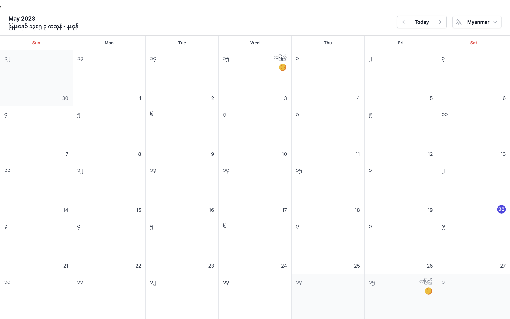
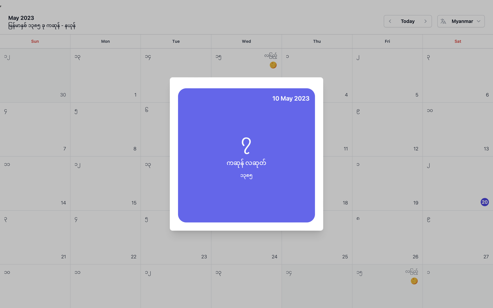

# Myanmar Calendar

**Myanmar Calendar** is a feature-rich calendar app that seamlessly combines the functionality of Gregorian and Myanmar
calendars, catering to users who follow both systems. It supports multiple languages, including Myanmar, Mon, English,
Tai, and Karen, ensuring a user-friendly experience for individuals from diverse linguistic backgrounds.
> We do provide npm package with the most curated interface for developers. Please
> check [here](https://www.npmjs.com/package/burma-calendar).

## Features

- Support Gregorian and Myanmar Calendar
- Support multiple languages
    - Mon
    - Tai
    - Karen
    - Burmese
    - English
- Displays Myanmar Day, Month, Year and Moon phase
- Easy-to-use interface, similar to Google Calendar and macOS Calendar
- SupportCross-platform
    - MacOS
    - Windows
    - Linux (Debian based distros)

## Demo

### Day Detail View

## Getting Started

To get started with the Myanmar Calendar software, simply download the software for your operating system (macOS, Linux,
or Windows) from our website or GitHub page. Once downloaded, double-click on the app to launch it.

## Usage

The Myanmar Calendar software is easy to use, with a user-friendly interface. Simply select your preferred language and
calendar type from the settings.

## Contributing

If you would like to contribute to the Myanmar Calendar software, please feel free to fork the repository and submit a
pull request with your changes. We welcome any contributions that improve the usability, performance, or features of the
app.

## License

The Myanmar Calendar software is released under the [MIT](./LICENSE) License. Please see the LICENSE file for more
details.

## Contact

If you have any questions or feedback about the Myanmar Calendar software, please open issue
at [here](https://github.com/cybermm/myanmar_calendar/issues).

